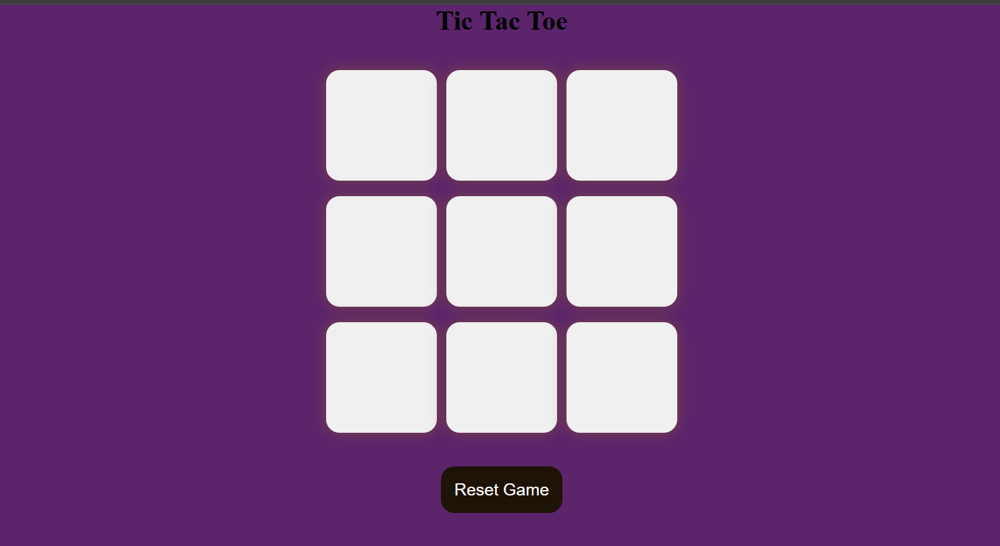

# 🎮 Tic Tac Toe Game

A simple and interactive Tic Tac Toe game built using **HTML**, **CSS**, and **JavaScript**. This web-based project allows two players to take turns and play the classic game in a clean and responsive UI.

## 🔧 Features
- Two-player mode
- Responsive and minimal design
- Reset game functionality

## 📸 Demo
 <!-- Replace with your own screenshot image -->

## 🚀 Technologies Used
- HTML5
- CSS3
- JavaScript (Vanilla)

## 📂 How to Run
1. Clone this repository:
   ```bash
   git clone https://github.com/yourusername/tic-tac-toe.git
